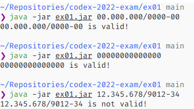

# Description

This program checks if the given CNPJ is valid or not.

# Requirements

Your machine must have installed any version of Java (mine is 16) and Kotlin's compiler (if you are
in Linux, just install the later with `sudo snap install --classic kotlin`). For more information of
how to install Kotlin, look at this link https://kotlinlang.org/docs/command-line.html#snap-package.

# Setup

You need to compile it. You can run the command bellow that will generate the file
`rectangle.jar`.

~~~sh 
kotlinc ex01.kt -include-runtime -d cnpj.jar
~~~

# Usage

To check if a CNPJ is valid, run the program with the command bellow and replace 00000000000000
with the CNPJ that you want to check. The CNPJ can be given with the two formats as shown bellow,
you can give it with only the numbers or add the dots and slashes to make it more readable.

~~~sh
java -jar cnpj 00.000.000/0000-0000

# or

java -jar cnpj 00000000000000
~~~

# Printscreen

The printscreen bellow shows the program working, this shows that the program works fine with both
possible formats of CNPJ and it works correctly for the two different CNPJs, first is valid and 
the last is invalid.

