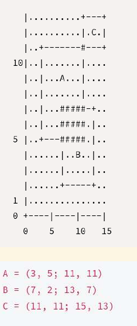
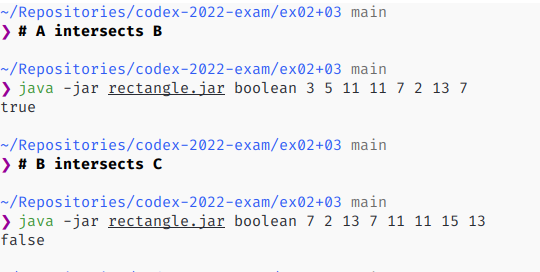
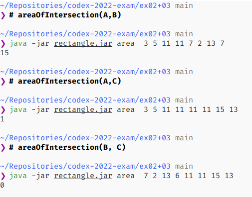

# Description

This is the implementation of exercises 02 and 03. With two rectangles that are lined with
the cartesian axes and each of them are described by two points located in oposite sides 
of the rectangule's diagonal, find if the rectangules intersects with each other (exercise 02) and
find the intersected area between those two rectangules (exercise 03).

# Requirements

Your machine must have installed any version of Java (mine is 16) and Kotlin's compiler (if you are
in Linux, just install the later with `sudo snap install --classic kotlin`). For more information of
how to install Kotlin, look at this link https://kotlinlang.org/docs/command-line.html#snap-package.

# Setup

You need to compile it first. You can run the command bellow that will generate the file
`rectangle.jar`.

~~~sh 
kotlinc rectangle.kt -include-runtime -d rectangle.jar
~~~

# Usage

To run the code, you must inform with the first parameter if you want to know if the two rectangles
intersects each other or if you want to know the value of intersected area between those two rectangles,
the first you add `boolean` in place of `option`, but if you want to know the area, replace `option`
with `area`.

The following arguments `n...` are the coordinates of the points that will describe the rectangles. The first rectangle
is defined by points (x, y) = (n1, n2) and (n3, n4), the second rectangle is define by the points (n5, n6)
and (n7, n8).

~~~sh
java -jar rectangle.jar option n1 n2 n3 n4 n5 n6 n7 n8
~~~

To make it more clear, we'll use this image bellow that was extracted from the wording and check
with the program if rectangles A and B intersect each other and other command to find the value of
the intersected area.

To check if A and B intersects, we run the following command:

~~~sh
java -jar rectangle.jar boolean 3 5 11 11 7 2 13 7
~~~

To check the value of intersected area between A and B, run the command:

~~~sh
java -jar rectangle.jar area 3 5 11 11 7 2 13 7
~~~

# Why merge exercises 02 and 03?

Avoid duplicated code between those two exercises, since the problem of those two exercises
are almost equal in my solution and with this merge is easier to find and fix errors.

# Printscreens

The image bellow shows that the program works correctly for the exercise 02.

The next image shows the program working correctly for the problem asked in exercise 03.

