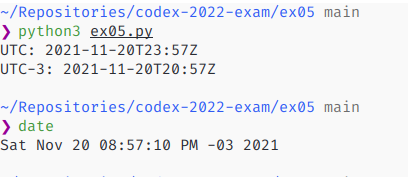

# Description

Get time in API 'http://worldclockapi.com/api/json/utc/now' and print the time in UTC and the time in my local timezone, UTC-3.

# Requirements

To run this script, you need `Python3` and the library `requests`.

# Usage

Just run in your terminal:

~~~sh
python3 ex05.py
~~~

This should return something similar to the output bellow, where the first line represents the date and time in UTC and the
second tells us the date and time in my local time, UTC-3.

~~~sh
UTC: 2021-11-19T13:53Z
UTC-3: 2021-11-19T10:53Z
~~~

# Printscreens

The image bellow shows that the program is working as expected, then I runned the Linux command `date` just to compare it 
and show that the program converts the UTC to UTC-3 correctly.

