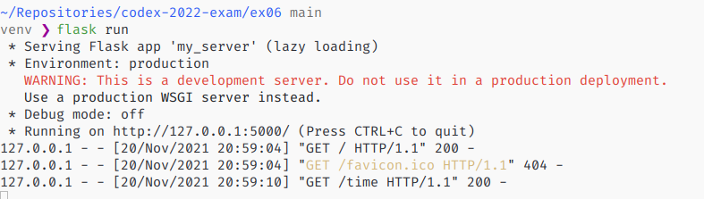
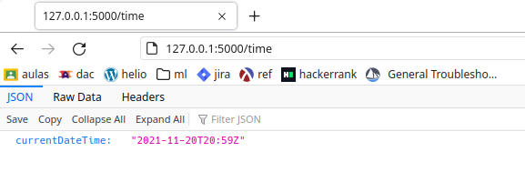

# Description

Create a REST-server to provide the local time. To do this, I did an API using Python3 and 
the framework Flask.

# Requirements

To run this script, you need `Python3` and the Flask framework. 

# Setup

After installing the requirements above, you must set the environmental variable `FLASK_APP` to 
`my_server`, because Flask needs to know which application to launch.

~~~sh 
export FLASK_APP=my_server
~~~

# Usage

Export the variable as described in [Setup](#setup) section first, then you run the command bellow: 

~~~sh
flask run
~~~

This should output something like: 

~~~sh
* Serving Flask app 'my_server' (lazy loading)
 * Environment: production
   WARNING: This is a development server. Do not use it in a production deployment.
   Use a production WSGI server instead.
 * Debug mode: off
 * Running on http://127.0.0.1:5000/ (Press CTRL+C to quit)
~~~

Finally just run the url printed in yout terminal with addition of the endpoint `/time`, in this
example, we'd open the url http://127.0.0.1:5000/time to get the desired JSON in our browser. 

# Trobleshooting 

You might get an error if there is another aplication already using the port 5000, a small fix to
this is running `flask run` with the flag `--port` followed by a number that will be the port to
access the API. E.g.: `flask run --port 3000` will run the API and it will be accessible in the
port 3000.

More details in https://flask.palletsprojects.com/en/2.0.x/server/#address-already-in-use.

# Printscreens

The images bellow shows the API working by the side of the API via logs and it works on the client's
side with the browser making a GET-request in the endpoint `/time`.

